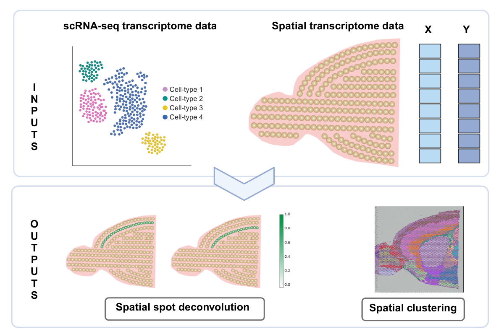
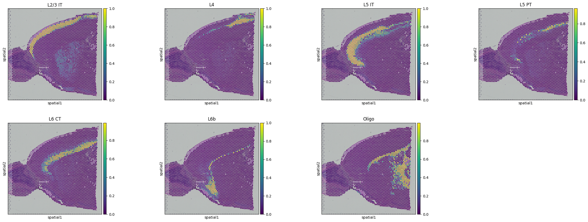

# SpatialPrompt : Spatially aware scalable and accurate tool for spot deconvolution and clustering in spatial transcriptomics

Article url: [abc.com] \
SpatialPromptDB database url: [https://swainasish.github.io/SpatialPrompt/] \
Tutorial.1.Mouse cortex: [https://swainasish.github.io/SpatialPrompt/Tutorials/Tutorial_1_SpatialPrompt/] 
Tutorial.2.Human dorsolateral prefrontal cortex: [https://swainasish.github.io/SpatialPrompt/Tutorials/Tutorial_2_DLPFC/]
### Graphical overview 

SpatialPrompt integrates gene expression, spatial location, and reference single cell RNA sequencing data for spatial deconvolution.\ For spatial clustering, tool requires only gene expression with spatial locations.
### Installation using PIP 
Platforms: Ubuntu: 22.04/20.04, Windows: 10/11, Mac-OS: Ventura - Python: 3.10 Preferable
```
pip install spatialprompt
```
## Qucik start
### Spatial spot deconvolution 
For spot deconvolutiom SpatialPrompt requires:
- `sc_array`: Matrix of Single-cell data, where rows are the cells and columns are the genes.
- `st_array`: Matrix of Spatial data, where rows are the cells and columns are the genes.
- `sc_genes`: Gene names of the `sc_array` matrix.
- `st_genes`: Gene names of the `st_array` matrix.
- `sc_labels`: Cell type annotations of `sc_array`.
- `x_cord`: X coordinate array of spatial data.
- `y_cord`: Y coordinate array of spatial data.
##### Import the library and download the data
```
import scanpy as sc
import spatialprompt as sp
import gdown
gdown.download("https://drive.google.com/uc?id=1n3ACaWjfjXJ8P6IJhxSUax_vBagIUPLV","sc_m_cortex.h5ad", quiet=False)
gdown.download("https://drive.google.com/uc?id=1h7E5nPs2ga1ixOBDjLJKK7V8xJq93ez5","st_m_cortex.h5ad", quiet=False)
```
##### Load the data into Scanpy and retrieve required information
```
sc_data = sc.read_h5ad("sc_m_cortex.h5ad")
st_data = sc.read_h5ad("st_m_cortex.h5ad")
#Requires raw data
sc_array = sc_data.X
sc_genes = sc_data.var_names
sc_labels = sc_data.obs.loc[:,"label"]
st_array = st_data.X.toarray()
st_genes = st_data.var_names
x_cord = st_data.obs.array_row
y_cord = st_data.obs.array_col
```
##### Perform Deconvolution
```
deconv_model = sp.SpatialDeconvolution()
cortex_predict = deconv_model.predict_cell_prop(sc_array,st_array,
                                                sc_genes,st_genes,
                                                sc_labels,x_cord,y_cord )
```
##### Plot the results 
```
for i in cortex_predict.columns:
    st_data.obs.loc[:,i] = cortex_predict.loc[:,i].values
sc.pl.spatial(st_data,
              color=("L2/3 IT", 'L4', 'L5 IT', 'L5 PT', 'L6 CT', 'L6b',"Oligo"),
              library_id='V1_Mouse_Brain_Sagittal_Anterior')
```

### Spatial domain identification
For domain identification SpatialPrompt requires:
- `st_array`: Matrix of Spatial data, where rows are the cells and columns are the genes.
- `x_cord`: X coordinate array of spatial data.
- `y_cord`: Y coordinate array of spatial data.
##### Import the library and download the data
```
import scanpy as sc
import spatialprompt as sp
import gdown
gdown.download("https://drive.google.com/uc?id=1h7E5nPs2ga1ixOBDjLJKK7V8xJq93ez5","st_m_cortex.h5ad", quiet=False)
```
##### Load the data into Scanpy and retrieve required information
```
st_data = sc.read_h5ad("st_m_cortex.h5ad")
#Requires raw data
st_array = st_data.X.toarray()
x_cord = st_data.obs.array_row
y_cord = st_data.obs.array_col
```
##### Perform spatial clustering
```
clus_model = sp.SpatialCluster()
cortex_domains = clus_model.fit_predict(st_array = st_array,
                                        x_cor = x_cord,
                                        y_cor = y_cord,n_cluster=20)
st_data.obs.loc[:,"SpatialPrompt: clusters"] = cortex_domains
```
##### Plot the results 
```
sc.pl.spatial(st_data,color=("SpatialPrompt: clusters"),
              library_id='V1_Mouse_Brain_Sagittal_Anterior',
              palette="tab20")
```
