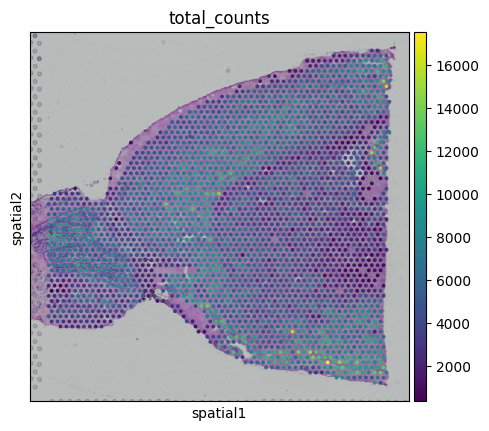
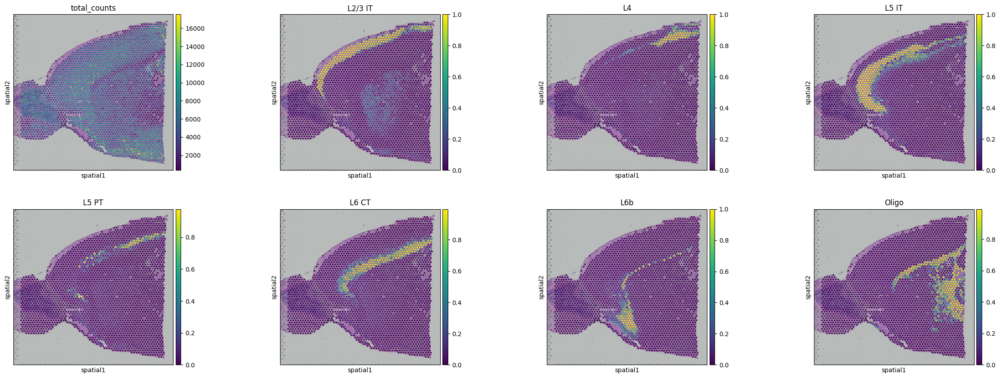
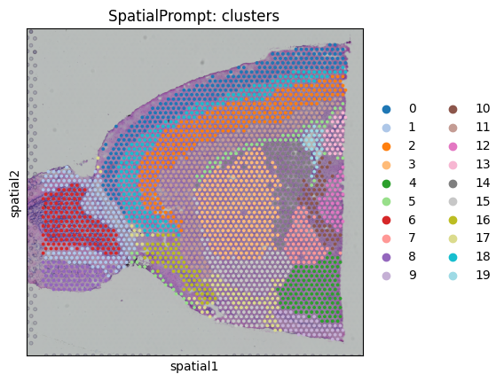

#Tutorial.1.Mouse-cortex-Visium
In this tutorial, we will perform spatial deconvolution and spatial clustering using 10X Visium mouse cortex dataset. The cortex Visium dataset can be obtain on the 10X-database. scRNA-seq reference obtained from Allen Institute, generated with the SMART-Seq2 protocol (GSE71585).
[](https://colab.research.google.com/drive/1leAZVF45zNLzgj6QQT2CCFLbL9vIdObl?usp=sharing)

*Install* Basic packages


```python
!pip install scanpy
!pip install spatialprompt
```

    Installing collected packages: grapheme, about-time, alive_progress, spatialprompt
    Successfully installed about-time-4.2.1 alive_progress-3.1.4 grapheme-0.6.0 spatialprompt-0.0.4


**Import major libraries**


```python
import pandas as pd
import scanpy as sc
import spatialprompt as sp
import numpy as np
import urllib
```

We will use mouse cortex Visium dataset and correspond single cell data


```python
urllib.request.urlretrieve("https://drive.google.com/uc?id=1TjCV0uV8Qx0qbT-3mt_XhQ4BK51TH8Mn", filename="sc_m_cortex.gz")
urllib.request.urlretrieve("https://drive.google.com/uc?id=11Diy9cKbVvfChK5VuGtxZWi0taH_7gqZ", filename="st_m_cortex.gz")
```


    ('st_m_cortex.gz', <http.client.HTTPMessage at 0x7f1401d04580>)


```python
!gunzip  sc_m_cortex.gz
!gunzip  st_m_cortex.gz
```


```python
sc_data = sc.read_h5ad("sc_m_cortex")
st_data = sc.read_h5ad("st_m_cortex")
```

    /usr/local/lib/python3.10/dist-packages/anndata/_core/anndata.py:121: ImplicitModificationWarning: Transforming to str index.
      warnings.warn("Transforming to str index.", ImplicitModificationWarning)


Basic process and visualise the scanpy object


```python
sc.pp.calculate_qc_metrics(st_data,inplace=True)
```


```python
sc.pl.spatial(st_data,color="total_counts",
              library_id='V1_Mouse_Brain_Sagittal_Anterior')
```


    

    


Extract all the data-required for SpatialPrompt \
Required inputs

1.   scRNA-seq reference matrix (sc_df) (numpy array will be preferred)
2.   sc_df gene names (sc_genes)
3.   sc_df cell-type annotations (sc_labels)
4. Spatial reference matrix (st_df)
5. st_df gene names (st_genes)
6. spatial x and y coordinate (st_X, st_Y)


```python
sc_df = sc_data.X
sc_genes = sc_data.var_names
sc_labels = sc_data.obs.loc[:,"label"]
st_df = st_data.X.toarray()
st_genes = st_data.var_names
st_X = st_data.obs.array_row
st_Y = st_data.obs.array_col
```

Perform spatial deconvolution


```python
deconvolution_model = sp.SpatialDeconvolution()
```


```python
cortex_predict = deconvolution_model.predict_cell_prop(sc_array = sc_df,
                                                       st_array = st_df,
                                                       sc_genes = sc_genes,
                                                       st_genes = st_genes,
                                                       sc_labels = sc_labels,
                                                       x_cord = st_X,
                                                       y_cord = st_Y)
```

    Preprocessing Datasets : |████████████████████████████████████████| 6/6 [100%] in 0.3s (22.32/s) 
    1337 Common Genes Found 1000 HVGs Retained
    Simulate Spatial Spots : |████████████████████████████████████████| 25584/25584 [100%] in 16.9s (1516.48/s) 
    25584 Spatial Spots Simulated
    Capturing spatial microenvironment relation: |████████████████████████████████████████| 5/5 [100%] in 12.0s (0.42/s) 
    Spot Denvolution: |████████████████████████████████████████| 5/5 [100%] in 15.6s (0.32/s) 
    Total Time spent: 44.90159010887146 Sec


Visualising the results


```python
#Insert the cell type proportions into the spatial object
for i in cortex_predict.columns:
    st_data.obs.loc[:,i] = np.array(cortex_predict.loc[:,i])
```


```python
st_data
```


    AnnData object with n_obs × n_vars = 2597 × 1337
        obs: 'in_tissue', 'array_row', 'array_col', 'library_id', 'n_genes_by_counts', 'log1p_n_genes_by_counts', 'total_counts', 'log1p_total_counts', 'pct_counts_in_top_50_genes', 'pct_counts_in_top_100_genes', 'pct_counts_in_top_200_genes', 'pct_counts_in_top_500_genes', 'Astro', 'CR', 'Endo', 'L2/3 IT', 'L4', 'L5 IT', 'L5 PT', 'L6 CT', 'L6 IT', 'L6b', 'Lamp5', 'Macrophage', 'Meis2', 'NP', 'No Class', 'Oligo', 'Peri', 'Pvalb', 'SMC', 'Serpinf1', 'Sncg', 'Sst', 'VLMC', 'Vip'
        var: 'gene_ids', 'feature_types', 'genome', 'mt', 'hb', 'n_cells_by_counts', 'mean_counts', 'pct_dropout_by_counts', 'total_counts', 'log1p_mean_counts', 'log1p_total_counts'
        uns: '_scvi_manager_uuid', '_scvi_uuid', 'clusters_colors', 'leiden', 'library_id_colors', 'neighbors', 'spatial', 'umap'
        obsm: 'X_pca', 'X_umap', 'deconvolution', 'spatial'
        layers: 'counts'
        obsp: 'connectivities', 'distances'


```python
sc.pl.spatial(st_data,
              color=("total_counts","L2/3 IT", 'L4', 'L5 IT', 'L5 PT', 'L6 CT', 'L6b',"Oligo"),
              library_id='V1_Mouse_Brain_Sagittal_Anterior')
```


    

    


**Clustering the Visium data**


```python
clus_model = sp.SpatialCluster()
```


```python
cortex_clus_annotations = clus_model.fit_predict(st_array = st_df,
                                                 x_cord = st_X,
                                                 y_cord = st_Y,n_cluster=20)
st_data.obs.loc[:,"SpatialPrompt: clusters"] = cortex_clus_annotations
```

    Spatial clustering:  |████████████████████████████████████████| 5/5 [100%] in 2.9s (1.74/s) 
    Executed in 2.88875675201416 second


```python
sc.pl.spatial(st_data,color=("SpatialPrompt: clusters"),
              library_id='V1_Mouse_Brain_Sagittal_Anterior',
              palette="tab20")
```


    

    

