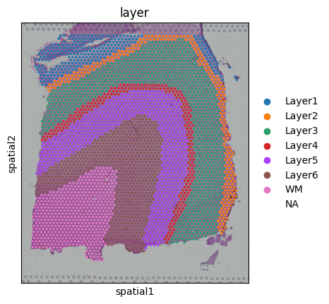
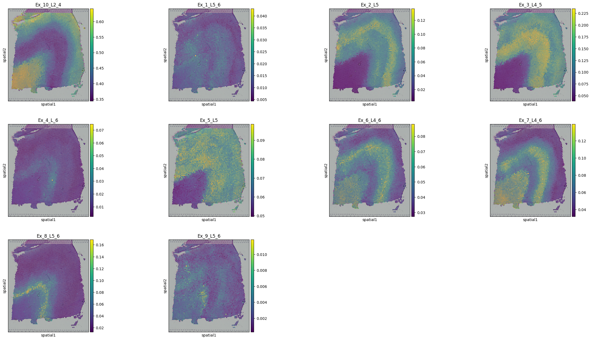
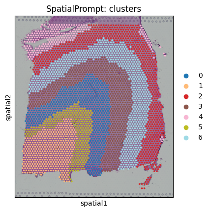

#Tutorial.2.Human-DLPFC-Visium
In this tutorial, we will perform spatial deconvolution and spatial clustering using 10X Visium human dorsolaterl prefrontal cortex (DLPFC) dataset. For this tutorial slide 151673 was choosen. The spatial data have gold standard manual annotations of seven cortical layer (layer-1 to layer-6 and white matter).scRNA-seq reference obtained from GEO (accession id: GSE144136).
[](https://colab.research.google.com/drive/1hfn10gV3NbG4guAgOb1DRkSam4RxfdI1?usp=sharing)

## Install libraries


```python
!pip install scanpy
!pip install spatialprompt
!pip install gdown
```

## Import necessary libraries


```python
import pandas as pd
import scanpy as sc
import spatialprompt as sp
import numpy as np
import urllib
```

## Data Download
### Here the original scRNA-seq data have 78,886 cells and 30,062 genes. Due to limited ram offered by colab the reference data was trimmed to 10,000 cells and 5,000 high variance genes.
### Due to trim down the reference, result in the manuscript and the result we see here may vary slightly.
### If the user have to trim down the reference, don't trim the cell type have less counts.


```python
!gdown https://drive.google.com/uc?id=1RcC0lu_rmVxcElRFWuTPbm12z94IwLQx
!gdown https://drive.google.com/uc?id=1jG9s91hTf1JeFheHHzsNN6Mk13qOjt6e
!gunzip libd_sc_obj.gz
!gunzip libd_st_obj.gz
```

    Downloading...
    From: https://drive.google.com/uc?id=1RcC0lu_rmVxcElRFWuTPbm12z94IwLQx
    To: /content/libd_sc_obj.gz
    100% 16.0M/16.0M [00:00<00:00, 34.5MB/s]
    Downloading...
    From: https://drive.google.com/uc?id=1jG9s91hTf1JeFheHHzsNN6Mk13qOjt6e
    To: /content/libd_st_obj.gz
    100% 28.0M/28.0M [00:01<00:00, 21.5MB/s]


## Read the data


```python
sc_data = sc.read_h5ad("libd_sc_obj")
st_data = sc.read_h5ad("libd_st_obj")
```

    /usr/local/lib/python3.10/dist-packages/anndata/_core/anndata.py:1838: UserWarning: Observation names are not unique. To make them unique, call `.obs_names_make_unique`.
      utils.warn_names_duplicates("obs")
    /usr/local/lib/python3.10/dist-packages/anndata/_core/anndata.py:1840: UserWarning: Variable names are not unique. To make them unique, call `.var_names_make_unique`.
      utils.warn_names_duplicates("var")


```python
st_data
```


    AnnData object with n_obs × n_vars = 3639 × 33538
        obs: 'in_tissue', 'array_row', 'array_col', 'layer', 'n_genes_by_counts', 'log1p_n_genes_by_counts', 'total_counts', 'log1p_total_counts', 'pct_counts_in_top_50_genes', 'pct_counts_in_top_100_genes', 'pct_counts_in_top_200_genes', 'pct_counts_in_top_500_genes'
        var: 'gene_ids', 'feature_types', 'genome', 'n_cells_by_counts', 'mean_counts', 'log1p_mean_counts', 'pct_dropout_by_counts', 'total_counts', 'log1p_total_counts'
        uns: 'layer_colors', 'spatial'
        obsm: 'spatial'


## Plot the data


```python
sc.pl.spatial(st_data,color="layer")
```


    

    


```python
sc_df = sc_data.X
sc_genes = sc_data.var_names
sc_labels = sc_data.obs.loc[:,"labels"]
st_df = st_data.X.toarray()
st_genes = st_data.var_names
st_X = st_data.obs.array_row
st_Y = st_data.obs.array_col
```

## Spatial Deconvolution


```python

```


```python
deconvolution_model = sp.SpatialDeconvolution()
```

Here, spot_ratio was choosen as [0,0,1] as the cell-types comprised of multiple sub-celltypes. So for simulation, we will simulate spots by randomly aggregating cells. Other parameters put as it is.


```python
cortex_predict = deconvolution_model.predict_cell_prop(sc_array = sc_df,
                                                       st_array = st_df,
                                                       sc_genes = sc_genes,
                                                      st_genes = st_genes,
                                                       sc_labels = sc_labels,
                                                       x_cord = st_X,
                                                       y_cord = st_Y,
                                                       spot_ratio= [0,0,1])
```

    Preprocessing Datasets : |████████████████████████████████████████| 6/6 [100%] in 2.0s (3.03/s) 
    4682 Common Genes Found 1000 HVGs Retained
    Simulate Spatial Spots : |████████████████████████████████████████| 25586/25586 [100%] in 13.7s (1871.05/s) 
    25586 Spatial Spots Simulated
    Capturing spatial microenvironment relation: |████████████████████████████████████████| 5/5 [100%] in 6.5s (0.77/s) 
    Spot Denvolution: |████████████████████████████████████████| 5/5 [100%] in 11.2s (0.45/s) 
    Total Time spent: 33.45342397689819 Sec


```python
#Insert the cell type proportions into the spatial object
for i in cortex_predict.columns:
    st_data.obs.loc[:,i] = np.array(cortex_predict.loc[:,i])
```


```python
st_data
```


    AnnData object with n_obs × n_vars = 3639 × 33538
        obs: 'in_tissue', 'array_row', 'array_col', 'layer', 'n_genes_by_counts', 'log1p_n_genes_by_counts', 'total_counts', 'log1p_total_counts', 'pct_counts_in_top_50_genes', 'pct_counts_in_top_100_genes', 'pct_counts_in_top_200_genes', 'pct_counts_in_top_500_genes', 'Ex_10_L2_4', 'Ex_1_L5_6', 'Ex_2_L5', 'Ex_3_L4_5', 'Ex_4_L_6', 'Ex_5_L5', 'Ex_6_L4_6', 'Ex_7_L4_6', 'Ex_8_L5_6', 'Ex_9_L5_6', 'SpatialPrompt: clusters'
        var: 'gene_ids', 'feature_types', 'genome', 'n_cells_by_counts', 'mean_counts', 'log1p_mean_counts', 'pct_dropout_by_counts', 'total_counts', 'log1p_total_counts'
        uns: 'layer_colors', 'spatial', 'SpatialPrompt: clusters_colors'
        obsm: 'spatial'


```python
sc.pl.spatial(st_data,
              color=('Ex_10_L2_4', 'Ex_1_L5_6', 'Ex_2_L5', 'Ex_3_L4_5', 'Ex_4_L_6', 'Ex_5_L5', 'Ex_6_L4_6', 'Ex_7_L4_6', 'Ex_8_L5_6', 'Ex_9_L5_6'))
```


    

    


```python
from sklearn.metrics import mean_squared_error,roc_auc_score,normalized_mutual_info_score,adjusted_rand_score
def metric_libd(predict):
    dictio ={}
    results = {}
    dictio['Ex_9_L5_6'] = ["Layer6","Layer5"]
    dictio['Ex_8_L5_6'] = ["Layer6","Layer5"]
    dictio['Ex_7_L4_6'] = ["Layer6","Layer4"]
    dictio['Ex_6_L4_6'] = ["Layer6","Layer4"]
    dictio['Ex_5_L5'] = ["Layer5"]
    dictio['Ex_4_L_6'] = ["Layer6"]
    dictio['Ex_3_L4_5'] = ["Layer4","Layer5"]
    dictio['Ex_2_L5']=["Layer5"]
    dictio['Ex_1_L5_6']=["Layer6","Layer5"]
    dictio['Ex_10_L2_4']=["Layer4","Layer2"]
    for i in dictio.keys():
        layers = dictio[i]
        binary_layer = [1 if j in layers else 0 for j in np.array(st_data.obs.layer)]
        ypred = predict.loc[:,i]
        auroc = roc_auc_score(binary_layer, ypred)
        results[i]=auroc
    return results
```


```python
sp_prompt = metric_libd(cortex_predict)
```


```python
sp_prompt
```


    {'Ex_9_L5_6': 0.6637322366873818,
     'Ex_8_L5_6': 0.830693844414161,
     'Ex_7_L4_6': 0.5970737580484741,
     'Ex_6_L4_6': 0.5381567132025175,
     'Ex_5_L5': 0.7123181094504434,
     'Ex_4_L_6': 0.9585830892982186,
     'Ex_3_L4_5': 0.9314685754520786,
     'Ex_2_L5': 0.6756835016767544,
     'Ex_1_L5_6': 0.7681178540017592,
     'Ex_10_L2_4': 0.5274225803684403}


```python
np.mean(list(sp_prompt.values()))
```


    0.7203250262600228


## Spatial Clustering


```python
clus_model = sp.SpatialCluster()
```


```python
cortex_clus_annotations = clus_model.fit_predict(st_array = st_df,
                                                 x_cor = st_X,
                                                 y_cor = st_Y,n_cluster=7)
st_data.obs.loc[:,"SpatialPrompt: clusters"] = cortex_clus_annotations
```

    Spatial clustering:  |████████████████████████████████████████| 5/5 [100%] in 1.9s (2.68/s) 
    Executed in 1.8699700832366943 second


```python
sc.pl.spatial(st_data,color=("SpatialPrompt: clusters"),
              palette="tab20")
```


    

    


```python
valids = ~pd.isna(st_data.obs.layer)
print(normalized_mutual_info_score(cortex_clus_annotations[valids],st_data.obs.layer[valids]))
```

    0.7081776384943014

